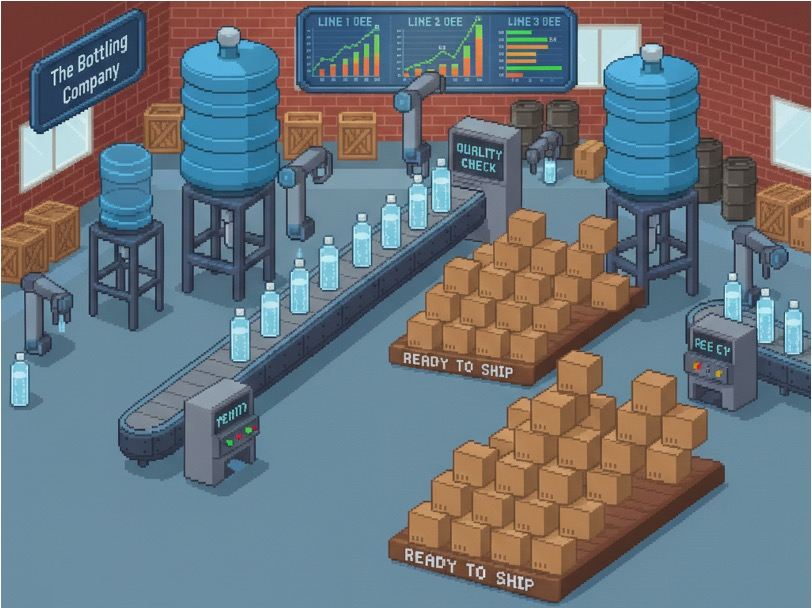

# The Bottling Company 🏭



# Overview 📋

The Bottling Company is a comprehensive manufacturing intelligence demonstration that showcases how AI can transform industrial operations through deep data insights. This demo simulates a modern bottling facility with multiple production lines, each equipped with sophisticated machinery and sensor networks that continuously monitor critical operational parameters. The facility generates vast amounts of real-time data from machine sensors, production metrics, maintenance activities, and quality control systems, creating the perfect environment to demonstrate the power of Snowflake Intelligence for manufacturing analytics. By combining machine sensor data, Overall Equipment Effectiveness (OEE) metrics, anomaly detection, and maintenance reports, this demo illustrates how organizations can achieve operational excellence through data-driven decision making and predictive insights.

## Use Case Deployment
Execute this SQL Query to create and run the notebook in your account which will generate data and required services.
```sql
EXECUTE IMMEDIATE FROM @AI_DEVELOPMENT.PUBLIC.GITHUB_REPO_SNOWFLAKE_INTELLIGENCE_DEMOS/branches/main/use_cases/The_Bottling_Company/setup/setup.sql
  USING (BRANCH => 'main', EXECUTE_NOTEBOOKS => TRUE) DRY_RUN = FALSE;
```

# Data 📊

This demo contains a rich dataset that simulates a realistic bottling facility with comprehensive operational data across multiple domains:

| Table Name | Description |
|------------|-------------|
| **DIM_LINES** | Production line master data containing line identifiers, names, and plant associations |
| **DIM_MACHINES** | Machine catalog with details about equipment across 7 machine types: Bottle Rinser, Bottle Filler, Capper, Labeler, Date Coder, Shrink Wrapper/Packer, and Palletizer |
| **DIM_SENSORS** | Sensor registry cataloging all monitoring devices with their measurement types and units (pressure, temperature, flow rate, fill level, torque, etc.) |
| **FACT_SENSOR_VALUES** | High-frequency sensor readings (minute-level) capturing real-time operational data |
| **FACT_SENSOR_VALUES_10_MINUTES** | Downsampled sensor data aggregated to 10-minute intervals for efficient analysis |
| **FACT_OEE** | Overall Equipment Effectiveness metrics tracking Availability, Performance, and Quality for each machine |
| **ANOMALIES** | Detected sensor anomalies identified through machine learning outlier detection algorithms |
| **MAINTENANCE_REPORTS** | Detailed technician reports documenting equipment incidents, root cause analysis, and corrective actions |

The dataset spans **14 days** of operational data across **3 plants** with **10 production lines** and **70 machines** equipped with **multiple sensors each**, generating comprehensive time-series data for realistic manufacturing analytics.

# Production Line ⚙️

This demo simulates a typical bottling production line with **7 sequential machine types**, each equipped with multiple sensors:

1. **Bottle Rinser** - Pressure, flow rate, temperature sensors
2. **Bottle Filler** - Fill level, product temperature, flow rate, tank pressure, weight sensors  
3. **Capper** - Torque, proximity, speed sensors
4. **Labeler** - Position offset, web tension, motor speed sensors
5. **Date Coder/Printer** - Ink level, print head temperature, bottle presence sensors
6. **Shrink Wrapper/Packer** - Film tension, tunnel temperature, motor current sensors
7. **Palletizer** - Robot position (X/Y/Z), gripper pressure, motor current sensors

Each machine includes realistic manufacturers (Krones, Sidel, KUKA, etc.) and generates sensor data at minute-level intervals to demonstrate comprehensive manufacturing intelligence capabilities.

# Example Questions ❓

The Snowflake Intelligence Agent can answer sophisticated questions about manufacturing operations, equipment performance, and maintenance activities:

> Have there been any anomalies for machine M_0007_02 in the past 14 days? If yes, what has been done to mitigate them? And how did they affect the machine's OEE? Send a detailed report to my email address.


<details>
<summary>An example of such a report looks like this:</summary>

[](resources/example_report.jpg)

</details>


## **Equipment Performance & OEE Analysis** 📈
- What manufacturers had the lowest OEE in the last 7 days?
- Which bottle filler machines had the lowest overall OEE in the past 14 days?
- Show me the average OEE performance by production line for the current month
- Which machines have consistently underperformed their expected production targets?

## **Anomaly Detection & Monitoring** 🚨
- Have there been any anomalies for machine M_0007_02 in the past 14 days? If yes, what has been done to mitigate them? And how did they affect the machine's OEE? Send a detailed report to my email address.
- What was the machine with the lowest OEE in the last 7 days? Visualize all relevant sensor values on an hourly level for that machine.

## **Maintenance & Operations** 🔧
- What maintenance activities were performed on machines with recent anomalies?
- Show me all maintenance reports for machine M_0007_02?
- Which production lines had the lowest availability?
- Which production lines had the lowest quality?

## **Cross-Domain Analytics** 🔄
- Which plant has the most reliable equipment based OEE performance?
- Generate a comprehensive operational health report for the past week including OEE trends and maintenance activities

# Business Impact 💼

The Snowflake Intelligence chatbot provides transformative business value by enabling manufacturing organizations to achieve operational excellence through AI-powered insights:

## **Operational Efficiency Gains** ⚡
- **Predictive Maintenance**: Early detection of equipment anomalies reduces unplanned downtime extends equipment lifespan
- **OEE Optimization**: Performance monitoring and trend analysis help identify bottlenecks and optimize production processes
- **Quality Improvement**: Sensor data correlation with quality metrics enables proactive quality control and reduces scrap rates

## **Decision-Making Enhancement** 🎯
- **Real-Time Visibility**: Instant access to comprehensive operational data enables faster, data-driven decision making
- **Root Cause Analysis**: AI-powered correlation analysis quickly identifies the source of production issues
- **Performance Benchmarking**: Cross-plant and cross-line performance comparisons drive continuous improvement initiatives

## **Competitive Advantages** 🏆
- **Digital Transformation**: Accelerate Industry 4.0 initiatives with AI-powered manufacturing intelligence
- **Scalability**: Cloud-native architecture supports expansion across multiple facilities and production lines
- **Compliance & Reporting**: Automated generation of operational reports for regulatory compliance and management dashboards
- **Knowledge Retention**: Digitize and preserve tribal knowledge from maintenance activities and operational best practices